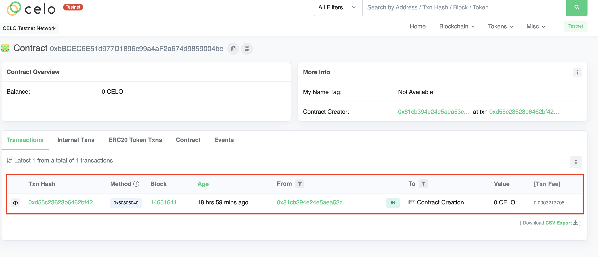
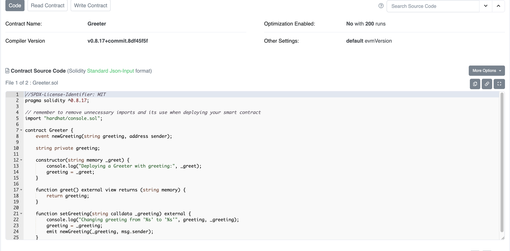

## Step 1 : Deploy Contracts

Now that you have your environment setup. The next thing to do is to compile the smart contracts that ships with the hardhat package so that we can startup our react app and see what it looks like.

To do this, first cd back into the hardhat package if you have not.

```
cd packages/hardat
```

Run this command

```
yarn run deploy
```

You will get an output similar to this, although with a different tx hash and different address of where the COntracts where deployed on Alfajores testnet. We will confirm that shortly using the celoscan explorer.

```bash
yarn run v1.22.19
$ hardhat deploy --export-all deployments/hardhat_contracts.json
(node:20217) ExperimentalWarning: stream/web is an experimental feature. This feature could change at any time
(Use `node --trace-warnings ...` to show where the warning was created)
Nothing to compile
deploying "Greeter" (tx: 0xd55c23623b6462bf4268e5f337dfc6762a5bd1b9138f7c7aa45c21a6271ebf68)...: deployed at 0xbBCEC6E51d977D1896c99a4aF2a674d9859004bc with 642741 gas
deploying "Storage" (tx: 0xcb81fe66f2ae8f9d203517e8621ed371ea626be5a6c91446a31a7b226117632d)...: deployed at 0xce59F6E977EC8FCcdD95a1Ffd32eCCad614f4552 with 181777 gas
deploying "SupportToken" (tx: 0x4667fb1fa152b5e48e90cf5e1769a303f7177b8aeaaacd67cd874fd739affce7)...: deployed at 0x1CF4cfb1ccDF2A570aF925fd6542F72d84666321 with 1342041 gas
✨  Done in 25.75s.
```

To confirm, that we actually deployed **Greeter**, **Storage** and **SupportToken** contracts to Celo Alfajores testnet. Copy the addresses after **deployed at** on each line and confirm on the celscan explorer.

In our own case let us confirm for the **Greeter** smart contract by visiting https://alfajores.celoscan.io/ and paste the address **0xbBCEC6E51d977D1896c99a4aF2a674d9859004bc** the the explorer search.



The above image shows a transaction of the smart contract being deployed on Celo testnet Alfajores. Next let us verify the contract code such that anyone who browses this page can view the Smart conract code and aknowledge that our contract is safe to use.

## Step 2: Verify Contract

There are several reasons why you might want to verify contracts you have deployed, and here are a few examples.

- It lets others interact with the contract directly celoscan.
- It’s a sign of transparency on your part.
- More people will use a Dapp with a verified contract than one which isn't. An unverified contract is equally a scam or a project with malicious intentions

To be able to verify our contract on celoscan, we need to get an **API KEY**.

1. Visit https://celoscan.io/, signup or sign in as the case may be.
2. Vist your profile https://celoscan.io/myaccount.
3. Click on API-KEYs tab which leads you here https://celoscan.io/myapikey.
4. Click on the **Add** button and add a new API Key.

Copy the newly generated API Key and update your _packages/hardhat.env_ with the this.

```
CELOSCAN_API_KEY=K7KR894C***************FKS71K
```

Remember to replace the value with your own celo scan API Key.

The format to run the command for verifying a smart contract is:

```
npx hardhat verify <CONTRACT_ADDRESS> <CONSTRUCTOR_ARGS> --network alfajores
```

To verify our exmaple Greeter smart contract that was deployed above, the command to run will be:

```
npx hardhat verify 0xbBCEC6E51d977D1896c99a4aF2a674d9859004bc 'hello world' --network alfajores
```

If you are wondering where **hello world** comes from. Thats because the Greeter smart contract takes a contructor argument when deployed and the value that was passed is **hello world**.

You can confirm this by opening _packages/hardhat/deploy/00-deploy.js_. Don't worry if its your first time with hardhat, in the **ERC721 NFT Example** page when we create,compile and deploy a new smart contract you will get a better understanding.

Once the smart contract verification is successful, you should get a similar output like below.

```bash
Nothing to compile
Successfully submitted source code for contract
contracts/Greeter.sol:Greeter at 0xbBCEC6E51d977D1896c99a4aF2a674d9859004bc
for verification on the block explorer. Waiting for verification result...

Successfully verified contract Greeter on Etherscan.
https://alfajores.celoscan.io/address/0xbBCEC6E51d977D1896c99a4aF2a674d9859004bc#code
```

Visit the url printed out in terminal. In our case https://alfajores.celoscan.io/address/0xbBCEC6E51d977D1896c99a4aF2a674d9859004bc#code, you will be presented with the verified smart contract.



Congratulations! 🎉. Next let us create a new ERC721 NFT Smartc ontract of our oun and launch the reach frontend to interact with it.
