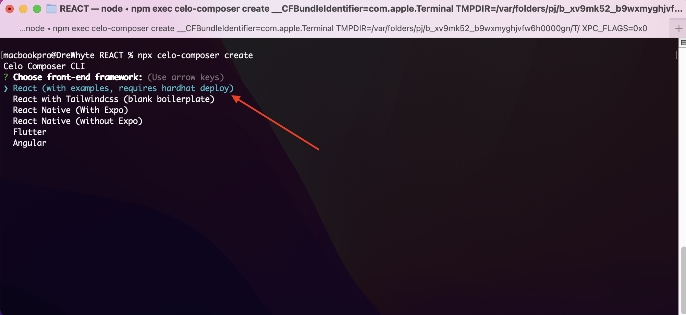
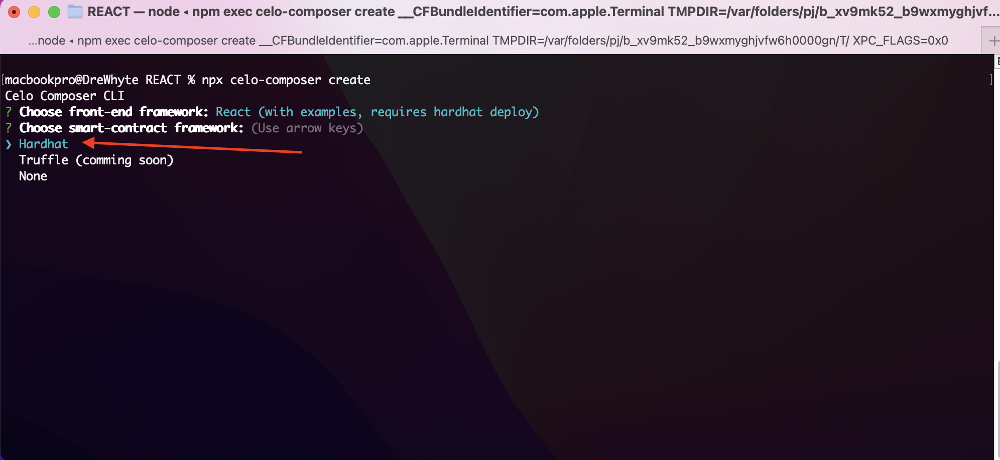
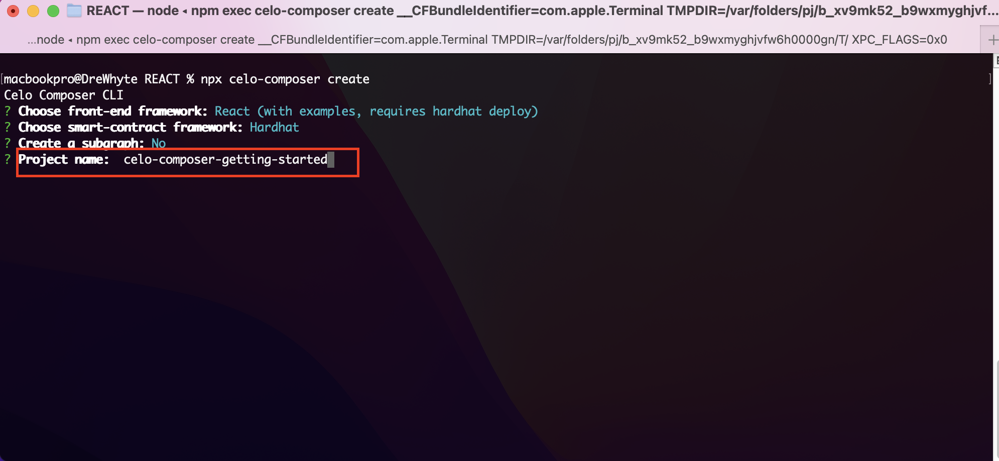
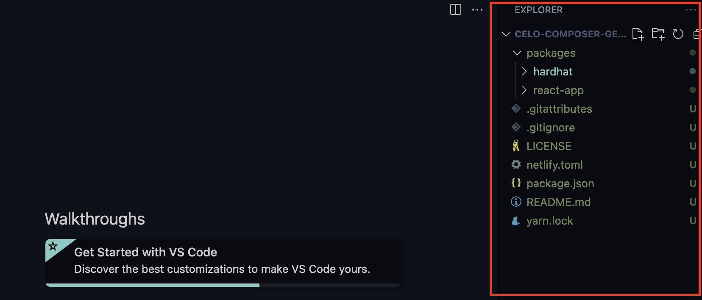
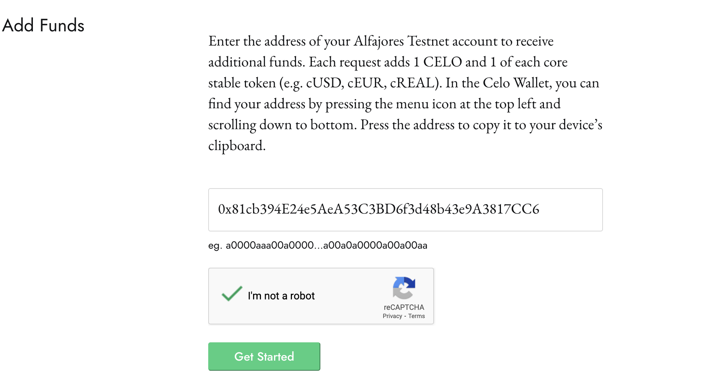
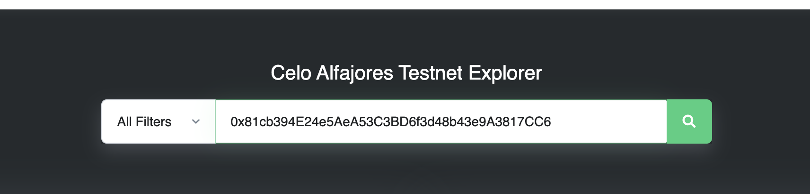
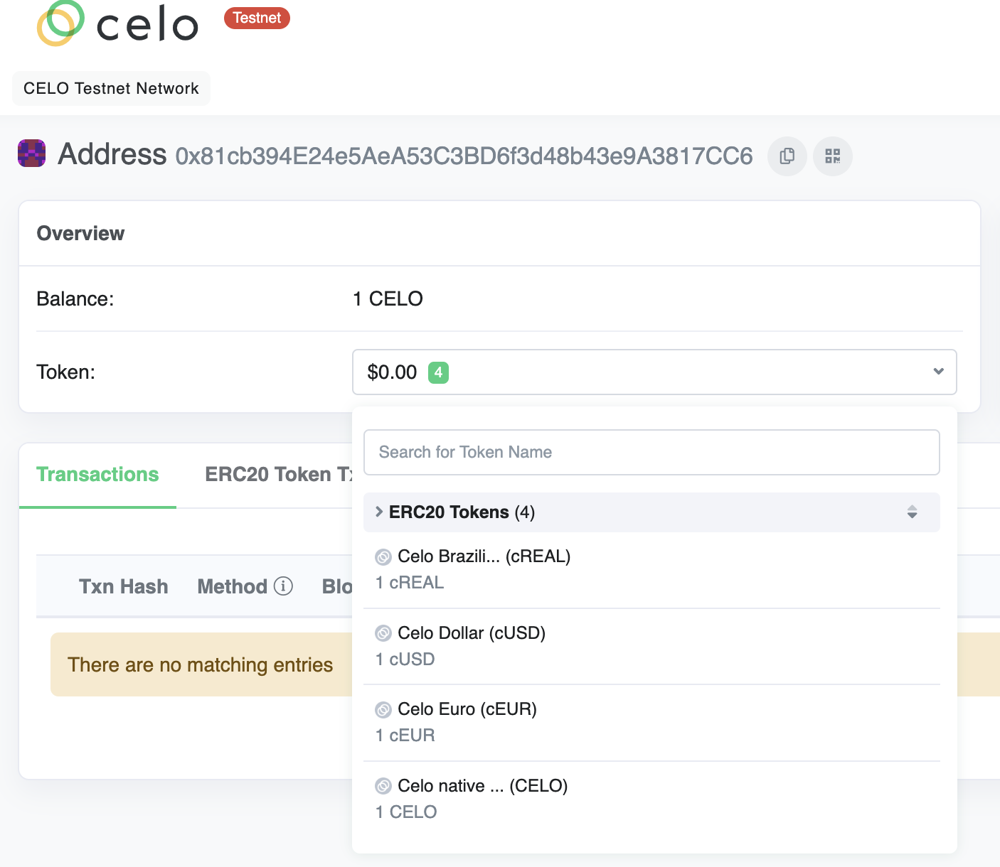

Getting started with celo composer is now easier than ever and less confusing than before, especially for new developers.
Thanks to the folks on the Celo deverel team for making a major update that allows you setup celo composer by running a command and only choosing what package you need for your development.

In this guide we will be setting up a celo composer project for using the React Nextjs package for our frontend and hardhat package for writing our smart contracts. We won't be including the graph package and as a choice of smart contract development environment we will be using **Hardhart** and not **Truffle**.

### Step 1: Setup Project

Install the celo composer package gollably on your machine by running

```
npm i @celo/celo-composer -g
```

After you have successfully done so, now its time to create a new project. Run below command and you will be prompted with the Celo Composer CLI

```
npx celo-composer create
```

Choose the first option, that shows **React (with examples ...)**


Next, choose smart contract for the smart contract framework.



We wont be need subgraph so we choose **No**.


Finally, enter the name of your project where the installation file will be, for this purpose we choose to use **celo-composer-getting-started**. we will assume in your case it will be the name of the project you are working on e.g _celo-swap-project_



When the installation is completed it will show you **💯 Done!**.

If you open your new Celo Composer project in your favourite editor, your directory structure should look like below. we currently use Celo Composer version _1.0.1_, so there might be some diffrence in the future if you are using a later version.



## Step 2: Setup a Testnet Account

_cd_ into _packages/hardhat_ from your terminal and run _yarn install_ to install needed dependecies for hardat package.

```
cd packages/hardhat

yarn install
```

Before generating your own private key to use in the development environment, we need for do two things.

- In the current _packages/hardhat_ folder, create _.env_ file
- Copy and paste the below placeholder variables here before we replace it with your own values

```
PRIVATE_KEY=0xba28d5cea192f121db5f1dd7f501532170bb7bb984c4d3747df3e251e529f77d
ACCOUNT_ADDRESS=0x81cb394E24e5AeA53C3BD6f3d48b43e9A3817CC6
```

> Disclaimer: The above private key is publicly known, so do not use it or send any live funds to it. Hackers might put non witjdrawable token inside of it to tempt you to send live funds to it.

Next to generate your own personally known private key and address to be used in your development environment. Run the below command in the _packages/hardhat_ folder root.

```bash
npx hardat create-account
```

Copy the value of the _PRIVATE_KEY_ outputted in terminal and use it to the replace the curent one in your _.env_ file, also copy the account address and use it to replace the current value of _ACCOUNT_ADDRESS_ in the _.env_ file.

Next fund your account address using the Celo Alfajores faucet. To do so visit https://celo.org/developers/faucet, paste your account address in the field input that says Testnet Address, validate the captacha and submit to request test funds.



You can confirm your balance by visiting https://alfajores.celoscan.io/. Paste your account address in the search explorer and click the search button.



You should be 1 CELO, 1 cReal, 1 cUSD, 1cEUR rich 🤑.


