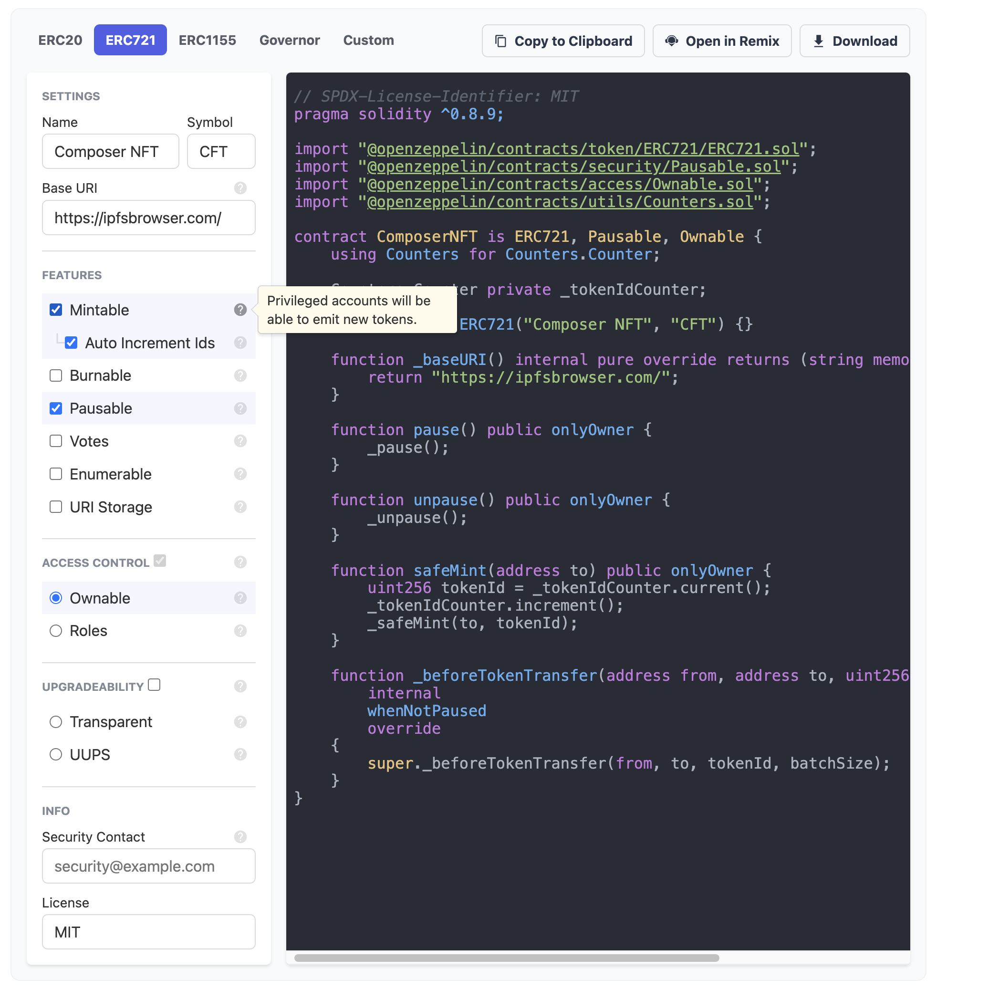

## Overview

Now that you have the knowledge of getting with Celo composer by using the react and hardhat packages. Let us solidify your knowledge by:

- Adding a new smart contract. An ERC721 NFT.
- Write a few tests for the smart contract.
- Interacting with the smart contract via the auto generated UI.

### Adding ERC721 NFT Contract

We will be writing an NFT smart contract that is mintable and pausable by the deployer. Thankfully there is openzeppelin contract wizard, an interactive generator to bootstrap commonly used smart contracts such as ERC20, ERC721, ERC1155. Which will suffice in our case.

In 5 simples steps :

- Visit https://docs.openzeppelin.com/contracts/4.x/wizard.
- Select **ERC721** option on the wizard.
- Provide Token Name & Symbol. You can use **Composer NFT** as name and **CFT** as symbol.
- Check mintable & pausable as one of the features.
- Check Ownable under access control.

You should have a contract that matches the image below:



Create a new file _ComposerNFT.sol_ in _/packages/hardhat/contracts_, copy to clipboard the code from the wizrad and paste.

### Write Javascript Test

Next inside the test folder create a new file _cft-test.js_ and delete the other test files, _storage-test_, _greeter-test_, _oracle-test_ all together.

Paste the below code.

```js
const { expect } = require("chai");
const { ethers } = require("hardhat");

describe("ComposerNFT", function () {
  before(async function () {
    const [owner, addressOne] = await ethers.getSigners();
    const ComposerNFT = await ethers.getContractFactory("ComposerNFT");
    const composerNft = await ComposerNFT.deploy();

    await composerNft.deployed();

    this.owner = owner;
    this.addressOne = addressOne;
    this.composerNft = composerNft;
  });

  it("Should mint nft to owner", async function () {
    this.composerNft.safeMint(this.owner.address);

    expect(await this.composerNft.balanceOf(this.owner.address)).to.equal(1);
  });

  it("Should revert if minting is not done by owner", async function () {
    expect(
      this.composerNft.safeMint(this.addressOne.address, {
        from: this.addressOne
      })
    ).to.be.revertedWith("Ownable: caller is not the owner");
  });

  it("Should be pausable", async function () {
    await this.composerNft.pause();

    expect(await this.composerNft.paused()).to.equal(true);
  });

  it("Should revert transfer when contract pause", async function () {
    expect(
      this.composerNft.transferFrom(
        this.owner.address,
        this.addressOne.address,
        0
      )
    ).to.be.revertedWith("Pausable: paused");
  });
});
```

To breakdown our test:

- First we created default in the _before_ block that runs before all of our test.
- We added a test to confirm owner wallet can mint an NFT and the balance reflects that.
- We added another test that confirms the contract reverts if an account asides the user account trys to mint an NFT.
- A third test is to confirm that owner account can pause the contract.
- Finally, when the contract is paused we added a final test to confirm that no transfer can be done.

Now that we are confident with our smart contract.

### Deploy & Verify Contract

This isn't something new. We already deployed some smart contract previously and verified the Greeter contract, so we will just follow the same steps as we did in the **Deploy & Verify Contract** section, except that we won't go over getting the _CELOSCAN_API_KEY_ set in _env_.

Open _/packages/hardhat/deploy/00-deploy.js_ and add this after the deploy function for SupportToken.

```js
await deploy("ComposerNFT", {
  from: deployer,
  log: true
});
```

Then append **ComposerNFT** to the list of the array on the _module.exports.tags_, such that it looks like below:

```js
module.exports.tags = ["Greeter", "Storage", "SupportToken", "ComposerNFT"];
```

Finally your terminal in the _packages/hardhat_ directory path. Run the below command to deploy the new smart contract.

```
yarn deploy
```

Your output will look like below, although the contract addresses shown for _deployed at_ will be different for you.

```bash
Nothing to compile
reusing "Greeter" at 0xbBCEC6E51d977D1896c99a4aF2a674d9859004bc
reusing "Storage" at 0xce59F6E977EC8FCcdD95a1Ffd32eCCad614f4552
reusing "SupportToken" at 0x1CF4cfb1ccDF2A570aF925fd6542F72d84666321
deploying "ComposerNFT" (tx: 0x7728f753572e932adb109f28f0c9aba4e123a67e7c79bafeafb133a4085166a7)...: deployed at 0xBbF8Fd3DF53e5fe3CA3062180aA4f0a1C5A529A6 with 2623301 gas
✨  Done in 21.97s.
```

To verify the contract run:

```bash
npx hardhat verify 0xBbF8Fd3DF53e5fe3CA3062180aA4f0a1C5A529A6 --network alfajores
```

Remember to replace the contract address with your own ComposerNFT deployed contract address.

### Launch UI

Navigate to the _packages/react-app_ folder from your terminal and run this command below or if you have your reach ui running no need.

```
yarn dev
```

When you visit [http://localhost:3000](http://localhost:3000/), the **COMPOSERNFT** tab will show up.


